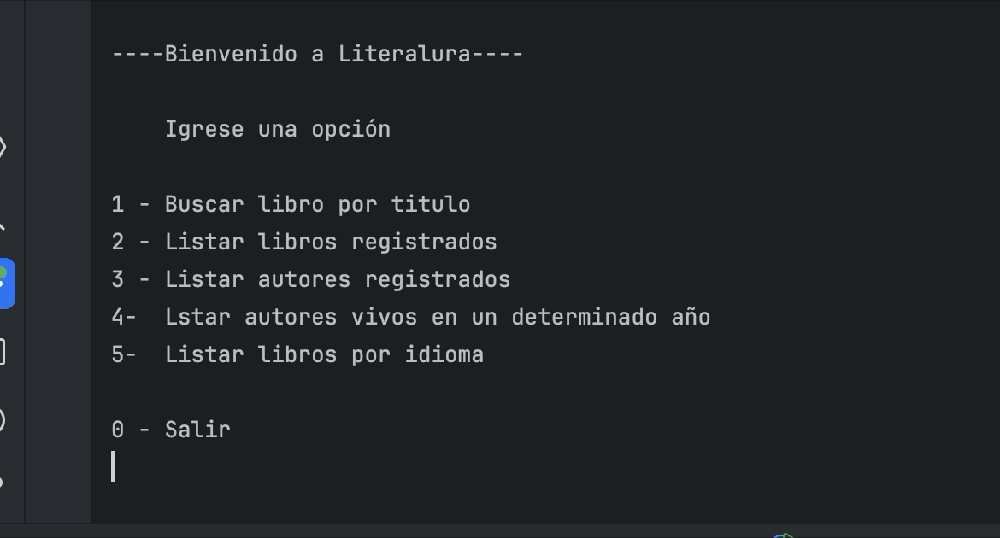
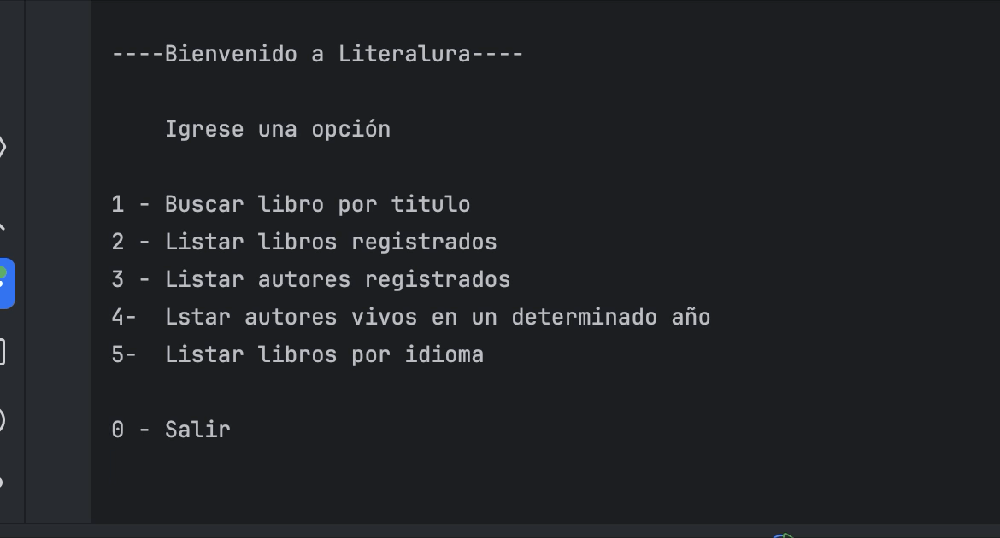

# 📚 Literalura: Explorador y Gestor de Libros

---

## 📖 Descripción del Proyecto

**Literalura** es una aplicación de consola desarrollada con **Java y Spring Boot** que te permite interactuar con la vasta colección de libros y autores de la **API de Gutendex**. Este proyecto, **creado como parte de un Challenge de Alura Cursos**, no solo te permite buscar y explorar libros, sino también almacenar la información en una base de datos **PostgreSQL** para una gestión y consulta eficiente.

---

## ✨ Características Principales

Literalura ofrece las siguientes funcionalidades:

1.  **Buscar libro por título:** Encuentra libros en la API de Gutendex y visualiza sus detalles. Si el libro no está en tu base de datos, lo guarda automáticamente.
2.  **Listar libros registrados:** Consulta todos los libros que has guardado en tu base de datos local.
3.  **Listar autores registrados:** Revisa la lista de autores cuyos libros han sido registrados en tu base de datos.
4.  **Listar autores vivos en un determinado año:** Filtra autores que estuvieron vivos en un año específico.
5.  **Listar libros por idioma:** Busca libros registrados por un idioma específico (Español, Inglés, Francés, Portugués).

---

## 🛠️ Tecnologías Utilizadas

* **Java 17**
* **Spring Boot 3.5.0**
    * Spring Data JPA
* **PostgreSQL** (como base de datos)
* **Maven** (para gestión de dependencias)
* **Jackson Databind** (para manejo de JSON)
* **API de Gutendex** (https://gutendex.com/)

---

## 🚀 Cómo Empezar

Seguí estos pasos para levantar y ejecutar el proyecto en tu entorno local.

### Prerequisitos

Antes de comenzar, asegurate de tener instalado lo siguiente:

* **JDK 17** o superior
* **Maven** (generalmente incluido o gestionado por el IDE)
* **PostgreSQL**: Base de datos instalada y funcionando.
* **Git**

### Configuración de la Base de Datos y Variables de Entorno

1.  **Crear la Base de Datos:**
    Creá una base de datos en PostgreSQL con el nombre `literalura`. Podés hacerlo de dos maneras:

    * **Desde la terminal (línea de comandos):**
        ```sql
        CREATE DATABASE literalura;
        ```

    * **Usando pgAdmin:**
        1.  Abrí **pgAdmin** y conectate a tu servidor PostgreSQL.
        2.  En el navegador de objetos (panel izquierdo), hacé clic derecho en "Databases" (Bases de datos).
        3.  Seleccioná "Create" (Crear) -> "Database..." (Base de datos...).
        4.  En el campo "Database" (Base de datos), escribí `literalura`.
        5.  Dejá las demás opciones por defecto o ajustalas según necesites.
        6.  Hacé clic en "Save" (Guardar).

2.  **Configurar Variables de Entorno:**
    Literalura utiliza **variables de entorno** para la conexión a la base de datos, lo que es una buena práctica de seguridad. Debés configurar las siguientes variables en tu sistema operativo:

    * `DB_HOST`: La dirección de tu servidor PostgreSQL (ej: `localhost:5432`).
    * `DB_USER`: Tu nombre de usuario de PostgreSQL.
    * `DB_PASSWORD`: Tu contraseña de PostgreSQL.

    
### Ejecución del Proyecto

1.  **Clonar el Repositorio:**
    Abrí tu terminal y cloná el repositorio de GitHub:
    ```bash
    git clone <URL_DE_TU_REPOSITORIO>
    cd literalura
    ```
    *(Reemplazá `<URL_DE_TU_REPOSITORIO>` con la URL de tu repo en GitHub).*

2.  **Importar y Ejecutar en tu IDE (IntelliJ IDEA, NetBeans, VS Code):**
    

---

## 💻 Uso de la Aplicación

Una vez que ejecutes la aplicación, verás el menú interactivo en la consola:

```----Bienvenido a Literalura----

Igrese una opción

1 - Buscar libro por titulo
2 - Listar libros registrados
3 - Listar autores registrados
4 - Listar autores vivos en un determinado año
5 - Listar libros por idioma

0 - Salir
```

Ingresá el número de la opción deseada y seguí las instrucciones en la consola.

---

## 🎬 Demostraciones

Aquí podés ver ejemplos de cómo funciona la aplicación:

### 1. Buscar libro por título



### 2. Listar libros registrados



### 1. Buscar libro por título

*(Aquí iría el GIF de la funcionalidad 1)*

### 2. Listar libros registrados

*(Aquí iría el GIF de la funcionalidad 2)*

---

## 📈 Mejoras Futuras / Posibles Extensiones

Este proyecto es un punto de partida sólido, y hay varias funcionalidades que podrían extenderse para hacerlo aún más robusto y útil:

* **Soporte para múltiples idiomas por libro:** Actualmente, un libro se guarda con un solo idioma. Sería ideal adaptar la base de datos y la lógica para que un libro pueda estar asociado a múltiples idiomas en los que esté disponible.
* **Top 10 libros por cantidad de descargas:** Implementar una funcionalidad que muestre los 10 libros más populares basados en su número de descargas, tanto desde la API de Gutendex como de los libros ya registrados en la base de datos.
* **Filtrado avanzado de autores:** Añadir más opciones de filtrado para autores, como buscar autores por fecha de nacimiento o fallecimiento específica, o por un rango de años.
* **Búsqueda por género/tema:** La API de Gutendex permite categorizar libros por tema. Sería interesante incorporar una funcionalidad para buscar libros por género o tema, ofreciendo una experiencia de exploración más rica.

## 📄 Licencia

Este proyecto está bajo la Licencia MIT.

---
